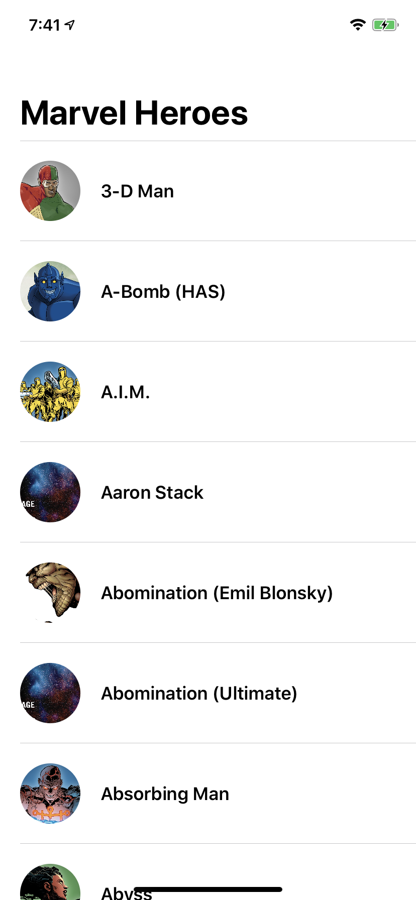
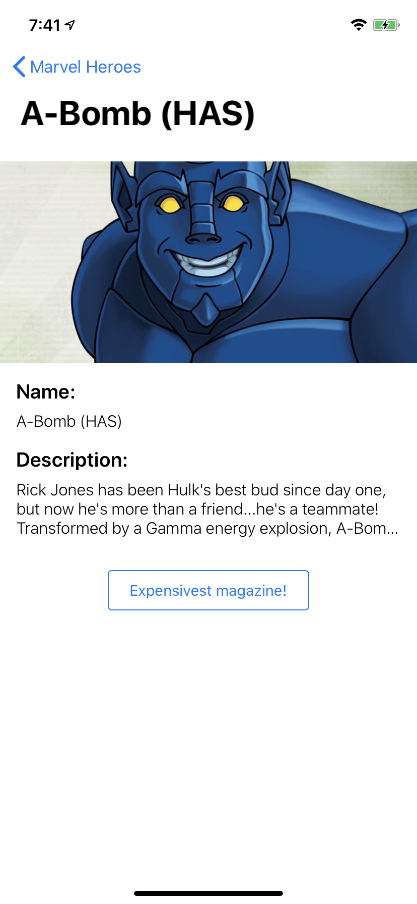
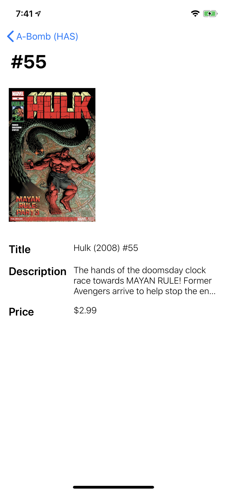
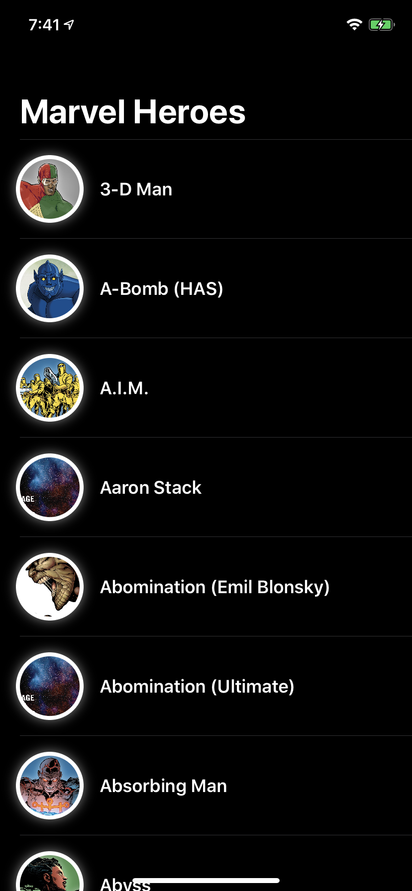
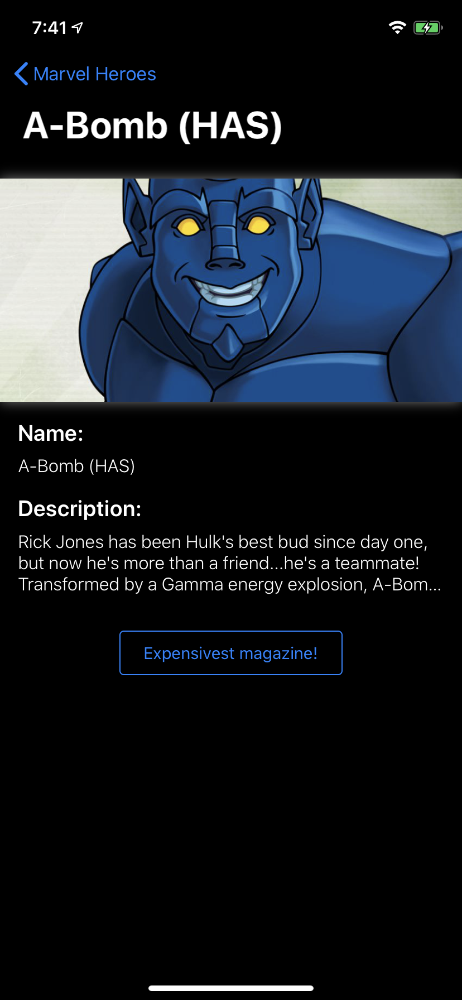
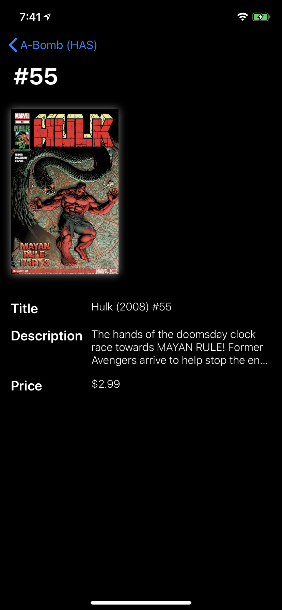

# desafio-ios-fernando-cani

## Instructions:
   > Project developed on Xcode 11.3.1 and macOS 10.15.3; might work on earlier versions, but this one is a guarantee one.
- Open `desafio-ios-fernando-cani.xcodeproj` on Xcode 11.3.1;
- Build on simulator

## If want to buil on device (recomended):
- Target `desafio-ios-fernando-cani`;
- Signing & Capabilities;
- Select a Team;
- Run

## fun facts:
- This project was build using **Catalyst**, meaning you can run on a computer running Catalina (10.15.0) or higher;
   >  It's not optimised, but works fairly well.
- The project was optimised for iOS Dark Mode. Fell free to try both layouts;
- Voice over ready;
- The app saves the images on the Documents Directory, there's a line in the `AppDelegate.swift`, *`Service.shared.clearDocumentDirectory()`* that clears the folder, so has no need to uninstall the app to try the download function again;
- There's a *tap to expand* on the images;
- I've try to stick to the proposition, but several improvements can be made;
- I've chose MVC as the architecture, for two reasons:
    1. The project is fairly simple, and the MVC works reasonable great;
    2. I'm more comfortable with MVC, especially because i didn't have the time and requirement to learn another one deeply, but i'm open to learn.

# Screenshots

### LightMode

### DarkMode

